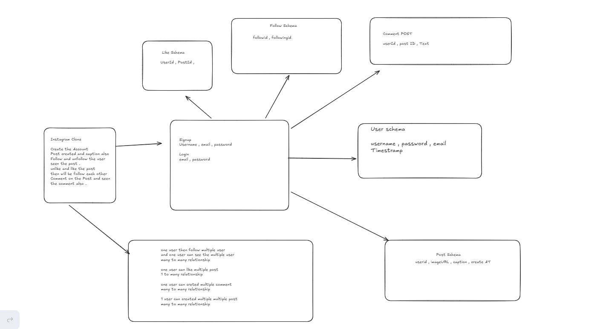

# InstaClone - Instagram Clone Application

A full-stack Instagram clone built with React, TypeScript, Node.js, Express, and MongoDB. This application allows users to create accounts, share posts, follow other users, like posts, and comment on posts.



## 🚀 Features

### User Authentication
- User registration and login
- JWT-based authentication
- Protected routes
- Secure password hashing with bcrypt

### Social Features
- **Posts**: Create, view, and delete posts with images and captions
- **Feed**: Personalized feed showing posts from followed users and other users
- **Follow/Unfollow**: Follow and unfollow other users
- **Likes**: Like and unlike posts with real-time updates
- **Comments**: Add comments to posts with username display

### User Interface
- Modern, responsive design with Tailwind CSS
- Beautiful gradient backgrounds and animations
- Smooth transitions and hover effects
- Real-time UI updates for likes, comments, and follows

## 🛠️ Tech Stack

### Frontend
- **React 19** - UI library
- **TypeScript** - Type safety
- **Vite** - Build tool and dev server
- **React Router DOM** - Client-side routing
- **Axios** - HTTP client
- **Tailwind CSS** - Styling

### Backend
- **Node.js** - Runtime environment
- **Express 5** - Web framework
- **TypeScript** - Type safety
- **MongoDB** - Database
- **Mongoose** - ODM for MongoDB
- **JWT** - Authentication tokens
- **bcryptjs** - Password hashing
- **CORS** - Cross-origin resource sharing

## 📁 Project Structure

```
insta_assigment/
├── backend/
│   ├── src/
│   │   ├── config/
│   │   │   └── db.ts          # MongoDB connection
│   │   ├── model/
│   │   │   ├── user.model.ts  # User schema
│   │   │   ├── post_model.ts # Post schema
│   │   │   ├── comment_model.ts # Comment schema
│   │   │   ├── like_model.ts # Like schema
│   │   │   └── follow_model.ts # Follow schema
│   │   ├── router/
│   │   │   ├── auth.routes.ts # Authentication routes
│   │   │   ├── post.route.ts  # Post routes
│   │   │   ├── feed.routes.ts # Feed routes
│   │   │   ├── like.route.ts  # Like routes
│   │   │   ├── comment.route.ts # Comment routes
│   │   │   └── follow.routes.ts # Follow routes
│   │   ├── authMiddleware.ts  # JWT authentication middleware
│   │   └── app.ts            # Express app setup
│   └── package.json
├── frontend/
│   ├── src/
│   │   ├── components/
│   │   │   ├── Login.tsx      # Login component
│   │   │   ├── Signup.tsx     # Signup component
│   │   │   ├── Home.tsx       # Main feed component
│   │   │   └── Protected.tsx # Protected route wrapper
│   │   ├── App.tsx            # Main app component
│   │   └── main.tsx           # Entry point
│   └── package.json
└── README.md
```

## 🔧 Installation

### Prerequisites
- Node.js (v18 or higher)
- MongoDB (local or MongoDB Atlas)
- npm or yarn

### Backend Setup

1. Navigate to the backend directory:
```bash
cd backend
```

2. Install dependencies:
```bash
npm install
```

3. Create a `.env` file in the backend directory:
```env
PORT=5000
MONGODB_URL=your_mongodb_connection_string
JWT_SECRET=your_jwt_secret_key
```

4. Start the development server:
```bash
npm run dev
```

The backend server will run on `http://localhost:5000`

### Frontend Setup

1. Navigate to the frontend directory:
```bash
cd frontend
```

2. Install dependencies:
```bash
npm install
```

3. Start the development server:
```bash
npm run dev
```

The frontend will run on `http://localhost:5173`

## 📡 API Endpoints

### Authentication
- `POST /api/auth/register` - Register a new user
- `POST /api/auth/login` - Login user

### Posts
- `POST /api/posts` - Create a new post (Protected)
- `DELETE /api/posts/:postId` - Delete a post (Protected)

### Feed
- `GET /api/feed` - Get personalized feed (Protected)
  - Returns posts from followed users and other users
  - Includes likes and comments for each post

### Likes
- `POST /api/posts/:postId/like` - Like a post (Protected)
- `POST /api/posts/:postId/unlike` - Unlike a post (Protected)

### Comments
- `POST /api/comments/:postId` - Add a comment to a post (Protected)
- `GET /api/comments/:postId` - Get comments for a post

### Follow
- `POST /api/follow/:userId` - Follow a user (Protected)
- `DELETE /api/follow/:userId` - Unfollow a user (Protected)
- `GET /api/follow/my` - Get list of users you're following (Protected)

## 🔐 Authentication

All protected routes require a JWT token in the Authorization header:
```
Authorization: Bearer <your_jwt_token>
```

The token is stored in localStorage after login and automatically included in requests.

## 🗄️ Database Models

### User
- `username` - Unique username
- `email` - Unique email
- `password` - Hashed password

### Post
- `userId` - Reference to User
- `imageUrl` - URL of the post image
- `caption` - Post caption
- `createdAt` - Timestamp

### Comment
- `userId` - Reference to User
- `postId` - Reference to Post
- `text` - Comment text
- `createdAt` - Timestamp

### Like
- `userId` - Reference to User
- `postId` - Reference to Post
- Unique constraint on (userId, postId)

### Follow
- `followerId` - Reference to User (who follows)
- `followingId` - Reference to User (who is followed)
- Unique constraint on (followerId, followingId)

## 🎨 Features in Detail

### Feed Algorithm
The feed displays:
1. Posts from users you follow (sorted by newest first)
2. Posts from users you don't follow (limited to 10, sorted by newest first)
3. All posts include likes and comments

### Like System
- Click the heart icon to like/unlike a post
- Like count updates in real-time
- Filled red heart indicates you've liked the post
- Outline heart indicates the post is not liked

### Comment System
- Add comments to any post
- Comments display with username
- Comments are sorted by creation time

### Follow System
- Follow button changes to "Following" when you follow a user
- Your feed updates to show posts from users you follow
- Cannot follow yourself

## 🚦 Running the Application

1. **Start MongoDB** (if running locally):
```bash
mongod
```

2. **Start Backend**:
```bash
cd backend
npm run dev
```

3. **Start Frontend** (in a new terminal):
```bash
cd frontend
npm run dev
```

4. **Open Browser**:
Navigate to `http://localhost:5173`

## 📝 Environment Variables

### Backend `.env`
```env
PORT=5000
MONGODB_URL=mongodb://localhost:27017/instaclone
JWT_SECRET=your_super_secret_jwt_key_here
```

## 🧪 Development

### Backend Scripts
- `npm run dev` - Start development server with nodemon
- `npm run build` - Build TypeScript to JavaScript
- `npm start` - Start production server

### Frontend Scripts
- `npm run dev` - Start Vite development server
- `npm run build` - Build for production
- `npm run preview` - Preview production build

## 🔒 Security Features

- Password hashing with bcryptjs
- JWT token-based authentication
- Protected API routes
- CORS configuration
- Input validation

## 🐛 Troubleshooting

### MongoDB Connection Issues
- Ensure MongoDB is running
- Check your `MONGODB_URL` in `.env`
- Verify network connectivity for MongoDB Atlas

### CORS Errors
- Ensure backend CORS configuration includes your frontend URL
- Check that credentials are enabled in CORS config

### Authentication Issues
- Clear localStorage and try logging in again
- Verify JWT_SECRET is set in backend `.env`
- Check token expiration

## 📄 License

ISC

## 👤 Author

Bharat

## 🙏 Acknowledgments

- Built as an assignment project
- Inspired by Instagram's user interface and functionality

